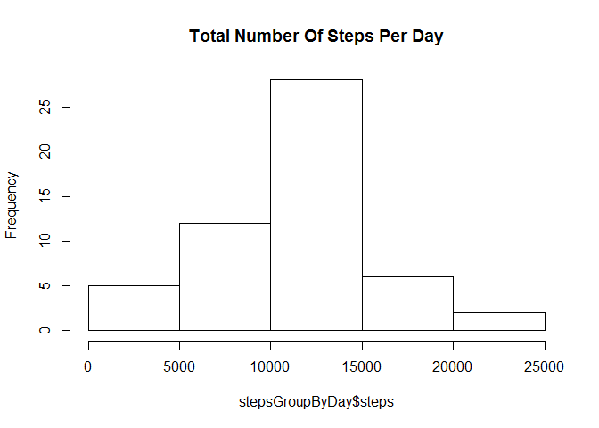
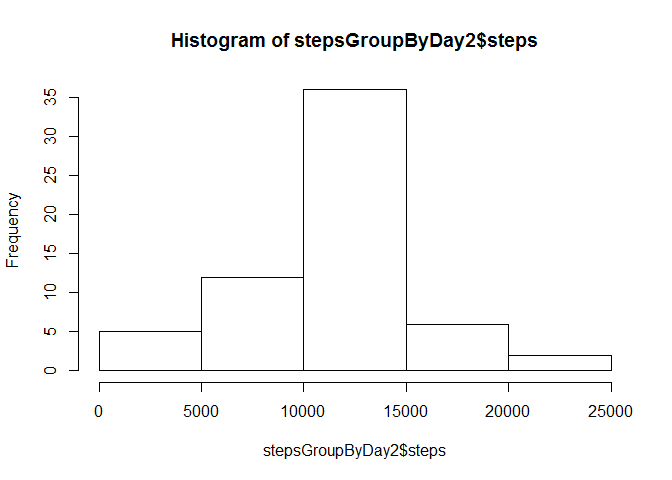
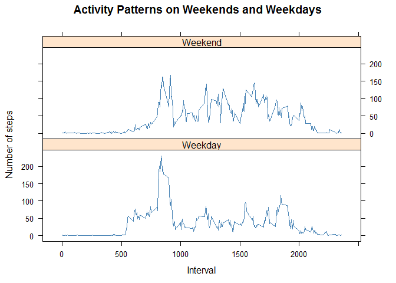

# Reproducible Research: Peer Assessment 1

Peer Assessment 1
=================

## Loading and preprocessing the data

```r
unzip(zipfile="activity.zip")
ds <- read.csv("activity.csv")
ds$date <- as.Date(ds$date,"%Y-%m-%d")
```

Histogram of the total number of steps take each day:

```r
stepsGroupByDay <- aggregate(steps ~ date, data = ds, sum ,na.rm = TRUE)
hist(stepsGroupByDay$steps, main = 'Total Number Of Steps Per Day')
```

 

## What is mean total number of steps taken per day?

```r
summary(stepsGroupByDay$steps)
```

```
##    Min. 1st Qu.  Median    Mean 3rd Qu.    Max. 
##      41    8841   10760   10770   13290   21190
```

## What is the average daily activity pattern?

```r
stepsPerInterval <- aggregate(steps ~ interval, data = ds, mean, na.rm = TRUE)
plot(steps~interval,data=stepsPerInterval,type="l")
```

 

## Inputing missing values

```r
missing <- !complete.cases(ds)
sum(missing == TRUE)
```

```
## [1] 2304
```

```r
ds2 <- ds[missing == TRUE,]
ds2[,1] <- stepsPerInterval$step

ds_filled_na <- rbind(ds[complete.cases(ds),], ds2)

stepsGroupByDay2 <- aggregate(steps ~ date, data = ds_filled_na, sum)
hist(stepsGroupByDay2$steps)
```

 

```r
summary(stepsGroupByDay2$steps)
```

```
##    Min. 1st Qu.  Median    Mean 3rd Qu.    Max. 
##      41    9819   10770   10770   12810   21190
```

## Are there differences in activity patterns between weekdays and weekends?

```r
weekdays <- weekdays(ds_filled_na$date)
ds_filled_na$weekdays <- ifelse(weekdays == "Sunday" | weekdays == "Saturday","Weekend", "Weekday")

stepsByWeek <- aggregate(ds_filled_na$steps, by=list(ds_filled_na$interval,ds_filled_na$weekdays),mean)

names(stepsByWeek) <- c("interval","weekdays","steps")
library(lattice)
xyplot(steps ~ interval | weekdays, stepsByWeek, type="l",layout=c(1,2), xlab="Interval", ylab = "Number of steps", main="Activity Patterns on Weekends and Weekdays", col = "steelblue")
```

 
